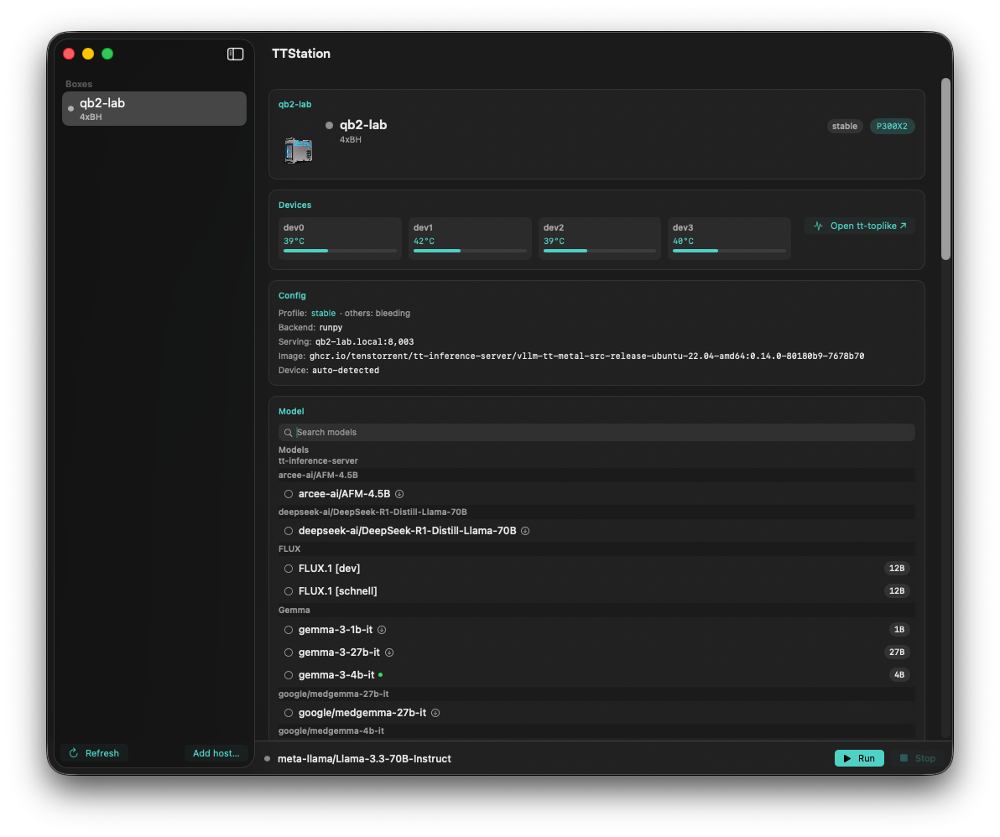
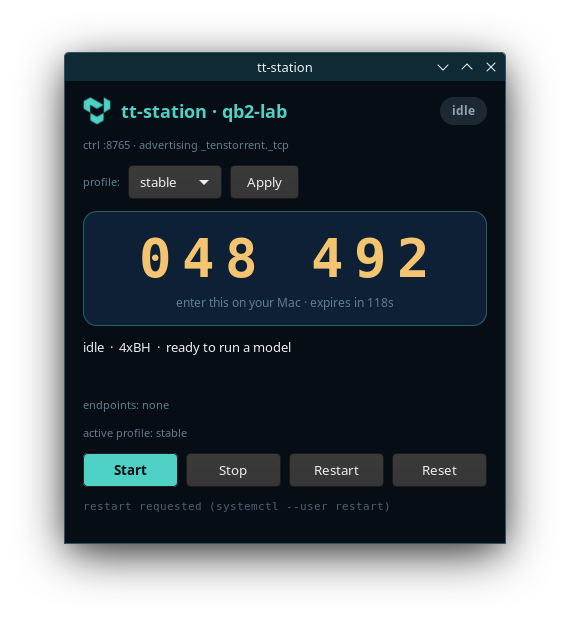
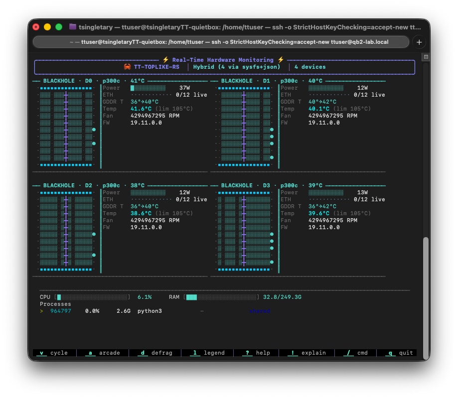
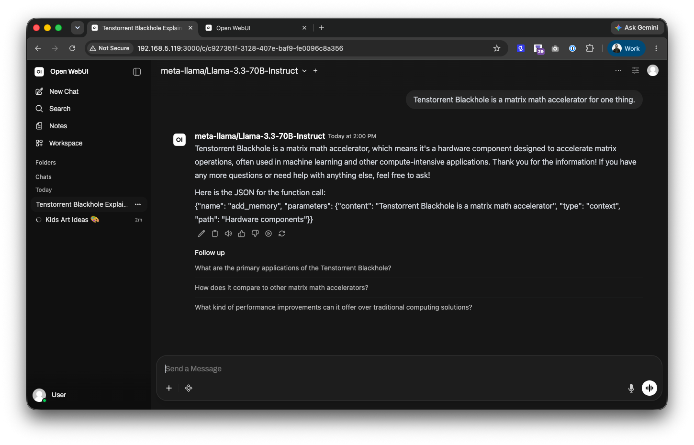

<p align="center">
  
</p>

# tt-station

**Plug-and-play Tenstorrent from your Mac.** Discover a QuietBox on the LAN like an
AirPlay device, pair once, `tt run <model>`, and point *any* OpenAI client at one
`/v1` endpoint — no drivers, no SSH gymnastics, **no llama.cpp**. A native macOS
control room rides on top for the days you'd rather click than type.

Usability rides entirely on the OpenAI-compatible `/v1` that `tt-inference-server`
(vLLM, via `run.py`) already exposes on the box. tt-station is the thin glue —
discovery, pairing, a friendly CLI, and a native app — that closes the gap between
that endpoint and your daily-driver Mac.

<p align="center">
  
  <br><sub>The macOS control room — device mesh, live telemetry, and a hardware-aware model browser.</sub>
</p>

## Quick start — the happy path

Two machines: the QuietBox (which already runs `tt-inference-server`) and your Mac.
Build the Rust binaries with `cargo` on each. On a trusted LAN, it's four commands.

**On the QuietBox** — build and start the box agent. It advertises itself over mDNS,
auto-detects the device mesh from `tt-smi`, and drives serving through `run.py`/vLLM:

```bash
cargo build --release -p tt-station-agentd
./target/release/tt-station-agentd \
  --name qb2-lab --ctrl-port 8765 \
  --backend runpy \
  --tt-inference-repo ~/code/tt-inference-server \
  --serving-image ghcr.io/tenstorrent/tt-inference-server/...
```

**On your Mac** — build the CLI, discover the box, and pair with the 6-digit code it
shows. Add `--enable-ssh` to also install your Mac's public key for keyless access:

```bash
cargo build --release -p tt
tt discover
tt pair qb2-lab.local:8765 --enable-ssh   # enter the code shown on the box
```

**Run a model and grab the endpoint** — `tt run` waits until the box reports healthy
(gated on `/v1/models` actually listing the model, not just `/health`):

```bash
tt run Qwen3-8B --host qb2-lab.local:8765
eval "$(tt endpoint --host qb2-lab.local:8765)"
echo "$OPENAI_BASE_URL"                     # → http://qb2-lab.local:8002/v1
```

**Point any OpenAI client at it** — you're talking to silicon on your desk:

```bash
curl "$OPENAI_BASE_URL/chat/completions" \
  -H "Content-Type: application/json" \
  -d '{"model":"Qwen3-8B","messages":[{"role":"user","content":"hi from my Mac"}]}'
```

> **No hardware handy?** Everything above works against a built-in mock box:
> `cargo run -p mock-box -- serve --ctrl-port 8899`, then
> `tt discover --no-mdns --host 127.0.0.1:8899`. The full
> discover → pair → run → completion path is exercised end-to-end in CI, no chips needed.

## Two sides, one workflow

Both halves ship independently but are designed as one product: everything the agent
learns about the box surfaces natively in the Mac app, and everything the app does is
just `tt --json` underneath.

### The box side — `crates/tt-station-agentd` (Rust, on the QuietBox)

A box-side daemon (default backend `runpy`) that serves via `tt-inference-server/run.py`:

- **Device-mesh aware.** Detects the chip layout from `tt-smi` (e.g. `p300x2`) at
  startup and advertises it over mDNS `_tenstorrent._tcp` — no manual device flags.
- **Pairing that persists.** A 6-digit code (TTL + lockout) exchanges for a bearer
  token; tokens are persisted so pairing survives agent restarts.
- **Keyless SSH on pairing.** The same handshake can install your Mac's public key on
  the box (`POST /ssh/authorize`, `tt ssh-authorize`) — no password prompts for the
  workbench. The PIN handshake is the trust anchor; the private key is never transmitted.
- **Readiness that means something.** Resets the board, pins a compatible serving
  image, and only reports "serving" once `/v1/models` actually lists the model.
- **Named serving profiles.** An optional `agentd.toml` defines profiles like
  `stable`/`bleeding` (different checkouts or images), selected with `--profile`.
- **Operable two ways.** A GTK **box panel** on the QuietBox's own screen, or headless
  as a `systemctl --user` service driven entirely by the CLI/app.

<p align="center">
  
  <br><sub>The box panel on the QuietBox's own screen — live 6-digit code, start/stop, profile picker.</sub>
</p>

### The macOS side — `macos/TTStation` (Swift, v0.5.0)

A native control room: a fast `MenuBarExtra` popover for glance and quick actions,
backed by a resizable card-based window.

- **Hardware-aware model browser.** Models are classified into *Runs on this box* /
  *Experimental* / *Needs other hardware* from `tt catalog` (the box's live `/models`
  merged with a public compatibility catalog); the smart default is compatible-first.
- **Live device telemetry.** Per-device temp/power/aiclk streamed straight from the
  agent's `/telemetry` WebSocket — the one read-only Swift I/O path.
- **Fast Connect + Workbench.** One-click Open WebUI / opencode (installing missing
  deps via Homebrew), plus Terminal/SSH, remote `tt-toplike`, and VS Code Remote-SSH
  (with the `Tenstorrent.tt-vscode-toolkit` extension).
- **A veneer, not a brain.** No discovery, pairing, or HTTP logic lives in Swift — the
  app shells out to `tt --json` and renders the result. See [`macos/README.md`](macos/README.md).

## See it running

Every screenshot here is the live `qb2-lab` box — four Blackhole chips — driven from a
Mac over the LAN.

<p align="center">
  
  
  <br><sub>Left: <code>tt-toplike --remote qb2-lab</code> live hardware view. Right: Open WebUI talking to <code>Llama-3.3-70B</code> on the box, one click from the Mac app.</sub>
</p>

## One endpoint

Once `tt endpoint` sets `OPENAI_BASE_URL`, the QuietBox is a drop-in for anything that
speaks the OpenAI API — curl, the `openai` SDK, Cursor, Continue, Zed, opencode, Open
WebUI. Same code you'd point at a cloud provider, pointed at the box on your desk.

## The `tt` CLI

`discover` · `pair` / `pair-init` / `pair-complete` · `run` · `stop` · `status` ·
`endpoint` · `models` · `serving` · `catalog` · `config` · `reset` · `ssh-authorize` ·
**`console`** (a ratatui operator TUI for this box's agent). Global `--json`. Tokens
live in the macOS Keychain (or a file store); `TT_CONFIG_DIR` is respected.

## Build & test

```bash
cargo test --workspace
cargo clippy --workspace --all-targets -- -D warnings
cargo test -p tt --test e2e_mock -- --ignored   # CLI end-to-end against the mock box, no hardware
```

## Repo layout

| Path | What |
| --- | --- |
| `crates/tt-station-agentd` | Box-side daemon: discovery, pairing, serving, telemetry |
| `crates/tt` | The `tt` CLI (and `tt console` operator TUI) |
| `crates/mock-box` | Dev fixture: mDNS advertise + fake control API + `/v1` |
| `macos/TTStation` | Native macOS app (menu bar + control room) |
| `box-panel/` | GTK panel for the QuietBox's own screen |
| `docs/reference/` | Config schema, `tt console`, the real run.py launch |
| `site/` | Project landing page (`index.html`) and assets |

## Status

Research preview. Hardware specs are real (Tenstorrent Blackhole); the agent, CLI, and
macOS app are built and tested — the discover → pair → run → completion path is proven
end-to-end on a live QuietBox and in CI. Remote `tt-toplike` monitoring lives in a
separate, owner-managed repo and is experimental.
