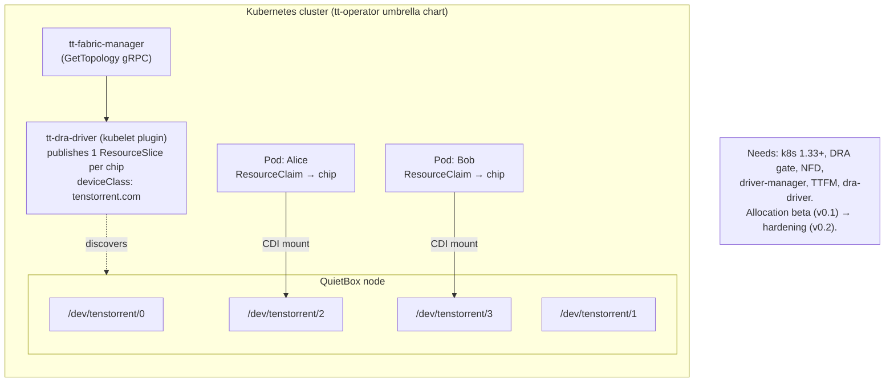
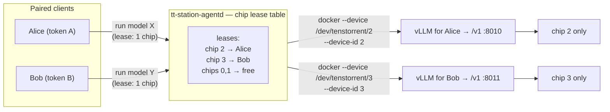

# Design sketch: assigning isolated chips to individuals

*Exploration, not a committed roadmap. Researched 2026-07-06 against tt-operator /
tt-dra-driver (public) + the real device layout on this QuietBox. Audience: same as the
rest of tt-station — a solo dev or a small team sharing one box, not an enterprise cluster.*

## The question

A QuietBox has **4 Blackhole chips**. Today tt-station serves **one model across the whole
box** (`--tt-device p300x2`, all 4 chips). Can we instead **hand individual chips to
individual people** — you get chip 2, your labmate gets chip 3 — each running their own
model, isolated from each other?

**TL;DR:** The isolation *primitive* already exists (per-chip device nodes), and it's the
exact same primitive Kubernetes DRA uses. tt-operator solves this the enterprise way (DRA
on a cluster). tt-station could solve it the *lightweight* way (per-chip leasing on one
box, keyed to the pairing identity we already have) — **but there are two real hardware
gotchas** (board-wide reset, and the inter-chip Ethernet mesh) that make "clean" isolation
harder than it looks. Details below.

## What the hardware already gives us (the primitive)

On this box, the kernel driver (`tt-kmd`) exposes **one device node per chip**:

```
$ ls -l /dev/tenstorrent/
crw-rw-rw- 237,0  0     # 0000:01:00.0  p300c
crw-rw-rw- 237,1  1     # 0000:02:00.0  p300c
crw-rw-rw- 237,2  2     # 0000:03:00.0  p300c
crw-rw-rw- 237,3  3     # 0000:04:00.0  p300c
```

Four chips → `/dev/tenstorrent/{0,1,2,3}`, each a distinct PCIe function. That's the unit
of isolation: a process/container that can open **only** `/dev/tenstorrent/2` sees one
chip. Two things to note:

- **They're world-`rw` by default** (`crw-rw-rw-`). Out of the box there is *no* OS-level
  isolation — any local user can open any chip. Per-user isolation means *adding* access
  control (per-node group/ownership, or a container device-cgroup that only grants the
  assigned node).
- tt-station already knows how to point a workload at specific chips: it passes
  `--tt-device` (mesh shape) and `--device-id` (e.g. `0,1`) through to
  `tt-inference-server`/`run.py`, and mounts `/dev/tenstorrent` into the serving container.

## How tt-operator does it (the enterprise answer: DRA)

From the public docs/repo (`tenstorrent/tt-operator`, `tt-dra-driver`,
docs.tenstorrent.com/tt-dra-driver — v0.1.0 shipped 2026-06-30, allocation **beta**,
hardening staged for **v0.2**):

- **`tt-dra-driver`** is a per-node kubelet plugin using Kubernetes **Dynamic Resource
  Allocation** (DRA, requires k8s **1.33+** + the DRA feature gate). It discovers the
  node's chips and publishes them as **`ResourceSlice`** objects — *one entry per chip* —
  under the device class **`tenstorrent.com`**.
- A user's workload requests a chip with a **`ResourceClaim`**:
  ```yaml
  apiVersion: resource.k8s.io/v1
  kind: ResourceClaim
  metadata: { name: tt-claim }
  spec:
    devices:
      requests:
        - name: chip
          exactly: { deviceClassName: tenstorrent.com }
  ```
  A Pod references the claim; the scheduler binds it to a specific chip; the driver
  **CDI-mounts** that chip's device node into the container. That CDI mount is, underneath,
  exactly "expose `/dev/tenstorrent/N` + restrict the cgroup" — the primitive above.
- It doesn't stand alone: it needs **`tt-fabric-manager` (TTFM)** to resolve topology
  first — *"the driver only publishes devices once topology resolves; on a host with no
  staged fabric topology the ResourceSlice set can be empty and claims will not bind."*
  So even single-node DRA drags in NFD + driver-manager + TTFM + the DRA plugin (the whole
  umbrella Helm chart).



This is the right answer **when you already have a cluster**. For a solo dev on one
QuietBox it's a lot of moving parts, and the allocation path is still maturing.

## The lightweight answer for tt-station (per-chip leasing on one box)

tt-station already has the two things a per-chip scheme needs: an **identity** (the pairing
token per client) and a **serving launcher** (it starts a per-model container with a chosen
device selection). Extend that to a **chip lease**: a client is assigned one (or N) chips,
and their serving stack is launched pinned to *only* those chips.



**Mechanically**, per lease the agent would:
1. **Assign** a free chip node to the requester (track it in a lease table keyed by the
   pairing token — reuse the token we already issue).
2. **Launch** their serving container exposing *only* that node —
   `docker run --device /dev/tenstorrent/2 …` (not the whole `/dev/tenstorrent` dir) — plus
   the matching `--device-id`/`--tt-device` so `run.py`/UMD targets that chip, on its own
   serving port. The device-cgroup makes the isolation real: the container can't touch the
   other chips even though the host nodes are world-`rw`.
3. **Return** a per-lease `/v1` endpoint (each user gets their own OpenAI endpoint on their
   chip).
4. **Release** the lease on stop (and reset *only* that chip — see gotcha #1).

This reuses tt-station's whole model (discover → pair → run → `/v1`) and just makes the
device selection *per-client* instead of whole-box. No k8s, no Helm, no cluster.

## The two hardware gotchas (the honest part)

These are why "just give everyone a chip" isn't free — and they apply to *any* approach,
including DRA:

1. **Reset is board-wide, not per-chip.** tt-station's `tt-smi -r` (and the "wedged mesh
   Ethernet cores" problem it fixes) operate at the **board** level. Resetting Alice's chip
   today can disrupt Bob's running model on the same board. Real per-user isolation needs a
   **per-chip / per-PCIe-function reset** path (or a policy that resets are only allowed
   when the board is idle). This is the single biggest blocker and worth confirming what
   `tt-smi`/`tt-kmd` support per-device.
2. **The chips are an Ethernet mesh, not four islands.** The 4 Blackhole chips are wired
   together (intra-box QSFP-DD/Ethernet) — that's *why* stopping one container can wedge
   "mesh Ethernet cores." So a chip isn't fully independent of its neighbors; carving one
   out cleanly (so one user's crash/reset can't touch another's) needs verification that a
   single-chip workload can run without disturbing mesh state the others rely on. Single-
   chip models are fine in principle (a p300c chip is a full accelerator), but the mesh
   coupling is a real "validate on hardware" item.

Other, smaller ones: **hugepages** may need per-container allocation; **fairness/quotas**
(who may lease how many chips, for how long); and **access control** — today any local
process can open any node, so the leasing has to be the thing that grants/revokes, ideally
backed by device-cgroup restriction rather than trusting cooperation.

## Where this leaves us — a recommendation

- **For the target audience (1 box, 1–few people):** the **lightweight per-chip lease**
  (Direction B) is the natural extension — it reuses pairing identity + the serving
  launcher, needs no cluster, and gives each person their own chip + `/v1`. Gate it on
  resolving **gotcha #1** (per-chip reset) first; #2 (mesh) needs a hardware spike but
  single-chip serving is plausible.
- **Don't build DRA into tt-station.** Instead treat tt-operator/DRA as the **on-ramp when
  you outgrow one box**: if the box ever joins a k8s cluster, defer chip allocation to
  `tt-dra-driver` and let tt-station be a thin UX veneer over `ResourceClaim`s. Same
  primitive underneath, so the mental model carries over — but it stays a *growth path*,
  not a dependency.
- **Note the third isolation axis:** dstack/confidential-VMs (the M4 `dstack` backend stub)
  isolate at the *VM* boundary rather than the *chip* boundary. Per-chip leasing and
  per-VM attestation are complementary, not competing.

**Next concrete step if we pursue this:** a hardware spike to answer the two gotchas — can
`tt-smi`/`tt-kmd` reset a single `/dev/tenstorrent/N` without touching its neighbors, and
can a single-chip vLLM run cleanly while another chip on the same board is busy? Everything
else (lease table, per-device `docker --device`, per-lease `/v1`) is a straightforward
extension of what tt-station already does.

## Sources

- tt-operator (umbrella chart, components): https://github.com/tenstorrent/tt-operator ·
  https://docs.tenstorrent.com/cloud-native-support/
- Device Allocation / DRA (`tt-dra-driver` — ResourceSlice/ResourceClaim, deviceClass
  `tenstorrent.com`, k8s 1.33+, TTFM dependency, beta→v0.2):
  https://docs.tenstorrent.com/tt-dra-driver/ · https://github.com/tenstorrent/tt-dra-driver
- Kubernetes DRA concept: https://kubernetes.io/docs/concepts/scheduling-eviction/dynamic-resource-allocation/
- Local hardware: `/dev/tenstorrent/{0..3}` (4× p300c, PCIe 01–04:00.0) on this QuietBox;
  tt-station device pinning in `crates/tt-station-agentd/src/serving/runpy.rs`
  (`--tt-device`, `--device-id`).
