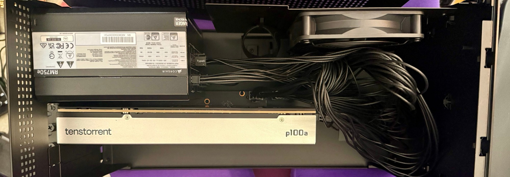
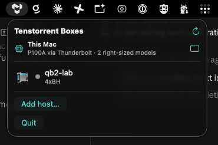
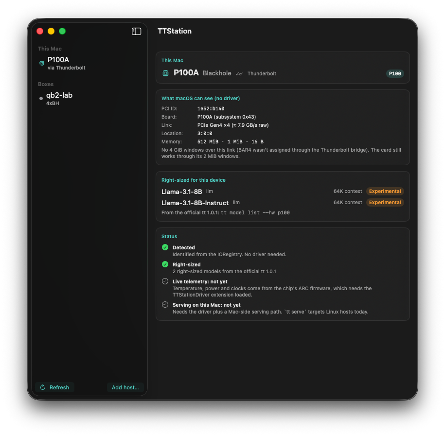
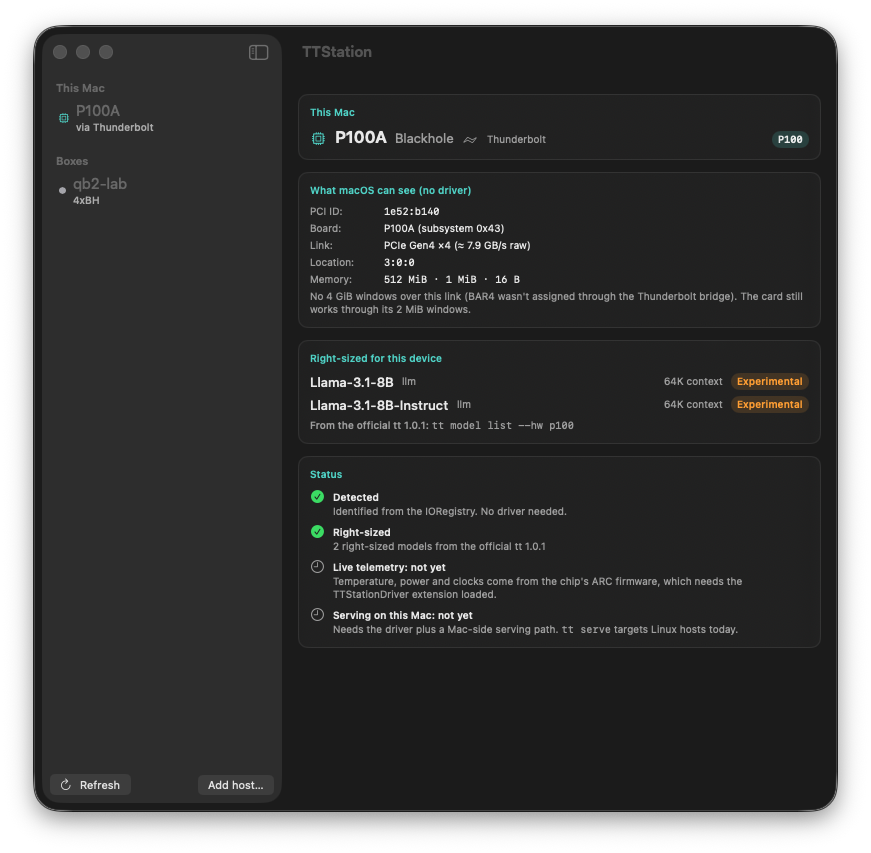

# A Tenstorrent P100 on a MacBook, over Thunderbolt: a journey log

A running, append-only log of getting a Tenstorrent Blackhole P100 to run models from a Mac,
kept so it can become a blog post someday. It records the story (what we tried, what
surprised us, what was wrong) and leaves the design to the spec:
[`docs/superpowers/specs/2026-09-28-macos-blackhole-dext-design.md`](../superpowers/specs/2026-09-28-macos-blackhole-dext-design.md).

**How to keep this log:** add a dated entry per session. Quote the real command output that
made each point. Keep the dead ends, because they are the interesting part. Leave the old
entries alone: when something turns out wrong later, say so in a new entry.

**The goal:** tt-station detects the Tenstorrent card attached to a Mac and asks the official
`tt` CLI / tt-model-manager to deploy a model right-sized for it. The card here is one modest
P100. We get there in small steps.

---

## 2026-09-28: "Macs don't do eGPUs. This isn't a GPU."

### The setup

- A MacBook Pro with Thunderbolt 5 (120 Gb/s ports) running macOS 26.
- A **Razer Core X V2** eGPU enclosure (USB4 v2).
- Inside it, instead of a graphics card, Taylor's own **Tenstorrent Blackhole P100**.



*The rig: a Tenstorrent **p100a** in the Razer Core X V2's slot, below the enclosure's Corsair
RM750e (750 W) power supply and a bundle of unused modular PSU cables. There's no GPU anywhere
in the box.*

Apple Silicon Macs don't support eGPUs *as GPUs*. But an enclosure is just a PCIe slot at the
end of a Thunderbolt cable, and a Tenstorrent card doesn't need to be a GPU. The first prompt:
*"look for prior art on GH for drivers like this."*

### First look: does macOS even see it?

It does. `system_profiler` lists the enclosure on bus 0 at 80 Gb/s, and `ioreg` shows the card
sitting there with nothing attached to it:

```
+-o pci1e52,b140@0  <class IOPCIDevice, ... registered, matched, active>
  "compatible"               = "pci1e52,43","pci1e52,b140","pciclass,120000"
  "IOPCITunnelled"           = Yes
  "IOPCIExpressLinkStatus"   = 4164          # 0x1044 → Gen4, x4
  "IODeviceMemory"           = 512 MiB, 1 MiB, 16 bytes
  "IOPCIDeviceMapperPageSize"= 16384         # Apple's DART IOMMU: 16 KiB pages
  "IOServiceDEXTEntitlements"= ("com.apple.developer.driverkit.transport.pci")
```

What each line means:

- **`1e52:b140`** is Tenstorrent's vendor ID and the Blackhole chip.
- **Subsystem `0x43`** is the P100.
- **Class `0x12`** is "processing accelerator".
- The last line is macOS saying, in effect, *"a PCIDriverKit driver extension may claim this."*
- The oddity is the **16-byte third memory region**. On Linux, Blackhole's BAR4 holds up to
  32 GiB of 4 GiB windows. That is filed as risk R1: park it and let the driver measure it.

### "There was an Apple Silicon Linux that had a driver working"

Taylor remembered Asahi Linux. There *was* a Tenstorrent bounty:

- [tt-metal#18296](https://github.com/tenstorrent/tt-metal/issues/18296), "Bring Up TT-Metal on
  Asahi", $2500, closed in August 2025.
- It turned out to be **packaging only**. The tt-kmd PR was closed as "non-functional on the
  Asahi platform due to its lack of PCIe support."

Taylor's comeback: *"it didn't work because no one tried an egpu."* That was fair (no one had),
but an eGPU wouldn't have helped:

- Asahi's 2026 USB4/Thunderbolt patches for M1–M3 support only XDomain and USB3 tunnels.
- **PCIe tunnels, the thing an enclosure needs, still aren't done.**
- This MacBook's TB5 also puts it at M4 or later, beyond what Asahi supports today.

The twist is that **macOS already does the part Asahi can't.** It tunnels PCIe and enumerates
the card. All that's missing is a driver.

### Prior art

Searching GitHub, the web and Tenstorrent's internal Glean turned up no attempt anywhere to
drive a Tenstorrent card from a Mac. The closest things were a tt-umd PR that builds on macOS
against the *simulator* only ([tt-umd#3411](https://github.com/tenstorrent/tt-umd/pull/3411),
where every hardware call returns `-ENOTSUP`), and some Slack chatter. The chatter included
the Razer Core X V2 being suggested for TT cards, and someone noting that *"tinycorp recently
got NVIDIA and AMD UMDs up on the Mac+eGPU front."*

That last lead was the key one:

- **[tinygrad's TinyGPU](https://github.com/tinygrad/tinygrad/tree/master/extra/usbgpu/tbgpu)**
  is an Apple-approved PCIDriverKit extension that runs NVIDIA/AMD GPUs over Thunderbolt on
  Apple Silicon.
- Its design is tiny. The driver opens the PCI device, and a user client hands the BARs to
  userspace through `IOConnectMapMemory64`. Everything else (config reads, reset, DMA setup)
  is a few RPCs.
- Its shipped app won't claim our card (the entitlement is scoped to NVIDIA/AMD vendor IDs and
  display-class devices), but the *design* ports almost one to one.
- **[blackhole-py](https://github.com/boopdotpng/blackhole-py)** runs Llama 3 8B on one
  Blackhole from pure Python, using only a handful of tt-kmd ioctls. That is a small surface
  to rebuild on top of a TinyGPU-style driver.

### The plan, and the real goal

Mid-build, Taylor sharpened the objective:

> our goal is to make tt-station able to invoke the new tt CLI / tt-model-manager and deploy
> models right-sized for the attached TT device. in this case, a small meager p100.
>
> we will get there in small steps.

So the driver is the first leg, not the destination. The milestones:

- **M1**: the driver attaches and the BARs map.
- **M2**: the first read from the chip's ARC firmware processor, over the NOC.
- **M3**: DMA, plus blackhole-py running on the Mac.
- **M4**: tt-station reports "P100 x1".
- **M5**: the official tooling deploys a right-sized model.
- **M6**: Apple signs the driver.

### Building the skeleton (M0)

`macos/TTStationDriver/` holds:

- **the driver extension** (`TTBlackholeDriver` + `TTBlackholeUserClient`), adapted from
  TinyGPU;
- **a headless host app** that asks macOS to activate it;
- **`tt-station-bh-probe`**, a read-only C smoke test;
- all generated with xcodegen.

Deliberate choices:

- **Match only `1e52:b140`.** TinyGPU's dev entitlements match *any* PCI device; ours stay
  scoped to Tenstorrent even in development.
- **Read-only RPCs in v1.**
- **Bus mastering stays off** until DMA exists, so the chip can't write host memory before
  we can give it a safe buffer.
- **Nothing is named `tt`.** That name belongs to the official CLI, and this project renamed
  itself away from it just last month.

The first build failed on one line:

```
TTBlackholeDriver.cpp:78:24: error: cannot deduce type of initializer list because
std::initializer_list was not found; include <initializer_list>
```

The line was `for (uint8_t bar : {0, 2, 4})`. DriverKit's C++ runtime is a stripped-down
subset, with no `std::initializer_list`. A plain `static const uint8_t kBars[]` fixed it. It's
a small reminder that a dext is its own little world.

The second build succeeded, with the result verified:

- a universal (arm64 + x86_64) `.dext` embedded at `Contents/Library/SystemExtensions/`;
- the personality resolved to `IOPCIPrimaryMatch 0xb1401e52` and `IOPCITunnelCompatible = true`;
- ad-hoc signed carrying the Tenstorrent-scoped `transport.pci` entitlement.

With no driver loaded, the failure paths behave:

```
$ ./tt-station-bh-probe
no 'ttstation-blackhole' service — is the dext activated and the card connected?
exit=1
$ TTStationDriver.app/Contents/MacOS/TTStationDriver install
Run from /Applications/TTStationDriver.app — macOS refuses dexts from elsewhere.
exit=3
```

### Corrections made along the way

- A research pass assumed "Thunderbolt 3, ~22–32 Gb/s". The actual hardware says otherwise:
  a USB4 v2 enclosure on an 80 Gb/s port, and a Gen4 x4 link to the card.

### Where it stands

- The driver compiles and signs, but **it has not been loaded yet.**
- Loading needs SIP disabled; whether `systemextensionsctl developer on` alone is enough is
  unknown.
- The next entry should be the first time macOS hands a Tenstorrent chip to our code, or the
  first reason it won't.

---

## 2026-09-28 (later): "…without booting into safe mode"

Taylor's constraint: *"try ways to make this work that don't require me to boot into safe
mode."* By safe mode they meant Recovery, where `csrutil disable` lives. So the question became
**which routes let an unsigned or self-built dext load while SIP stays on?**

### Dead end 1: developer mode

`systemextensionsctl developer on` is the documented switch for testing system extensions. It
turns you away at the door:

```
$ systemextensionsctl developer
At this time, this tool cannot be used if System Integrity Protection is enabled.
This limitation will be removed in the near future.
Please remember to re-enable System Integrity Protection!
```

It is a nice irony that the tool for *developing* extensions needs you to switch off the
system that makes extensions safe.

### Dead end 2: ad-hoc signing

We had already built an ad-hoc-signed app. Running it, even just `status`, was killed on the
spot: exit 137, no output. The unified log says why:

```
amfid: ... not valid: Error Domain=AppleMobileFileIntegrityError Code=-424
       "The file is adhoc signed but contains restricted entitlements"
kernel: proc 8524: load code signature error 4 for file "TTStationDriver"
```

`com.apple.developer.system-extension.install` is a *restricted* entitlement. With SIP on,
AMFI won't let an ad-hoc binary claim it at all, so we never even got as far as asking for the
dext.

(A side quest while reading that log: in zsh, `log` is a **shell builtin** that shadows
`/usr/bin/log`, so `log show …` fails with "too many arguments". This week's whole project
started with a name collision, `tt` versus our old CLI, and here was another one. The docs now
say `/usr/bin/log`.)

### What actually works with SIP on: a real team signature

Apple's DriverKit engineers wrote a forum post on this
([thread 809202](https://developer.apple.com/forums/thread/809202)). The old "disable SIP" advice
dates from when DriverKit was new. DriverKit now has **development entitlement variants** that are
*"available on all paid developer accounts without any special approval"* and that *"allow a DEXT
to match against any hardware"*. Xcode 16+ automatic signing handles the PCI family for
development. So the gate is not SIP: it's **a paid Apple Developer team**. This Mac has none
(`security find-identity` found 0 identities).

Getting ready for that meant one more design change. A development-signed dext shouldn't carry
`allow-any-userclient-access`, so clients need their own `userclient-access` entitlement.
That entitlement is restricted too, and a bare CLI tool can't embed a provisioning profile.
So the probe now also lives *inside the host app*, as `TTStationDriver probe`, and
`install-dev.sh --team <ID>` does the whole development-signed build in one pass.

### Plan B that needs no driver at all

tinygrad has a second eGPU trick:

- `CustomASM24Controller` in `tinygrad/runtime/support/usb.py` sends raw PCIe config and memory
  transactions through **libusb**, to a card sitting behind an **ASMedia ASM2464PD** USB-to-PCIe
  bridge.
- That needs no dext, no signing and no SIP change.
- The catches: a different (cheaper) enclosure, patched bridge firmware, slow MMIO, and almost
  no DMA.
- It's good enough to poke Blackhole registers (M1/M2), not to run models.

### Where it stands

- The skeleton is committed (`3501330`).
- The SIP-on route is ready to try the moment a paid team is signed in to Xcode.
- The open question is whose team: Tenstorrent's (signing reportedly got approved last
  week), or a personal $99 account to get moving.

---

## 2026-09-28 (evening): what fits a P100, and a ghost on this very Mac

Taylor started Apple's developer ID validation. Until that clears, the driver can't load, so
the question became what could move forward without it.

### The card tells us its name, and the silkscreen agrees

A Mac will show *any* process the IORegistry, driver or not. The card's PCI subsystem ID is
`0x43`, and luwen's board-type table (`crates/luwen-api/src/chip/mod.rs`) maps `0x43 => "p100a"`.
The photo at the top of this log, taken inside the enclosure, reads **p100a** on the shroud.
So tt-station can name the exact board from the Mac with no driver loaded.

### What's right-sized for a P100?

The official `tt` CLI already answers this. `tt model list --hw <device>` filters its catalog
to one device config and skips auto-detection, which is exactly what a Mac needs because it
can't auto-detect yet. The catalog it ships (release 0.22.0, 70 models) lists two for a
`p100`:

```
Llama-3.1-8B            p100   EXPERIMENTAL   ctx=65536
Llama-3.1-8B-Instruct   p100   EXPERIMENTAL   ctx=65536
```

That's a nice echo: Llama 3 8B is also the model blackhole-py runs on a single Blackhole.
"A small meager P100", in Taylor's words, gets one model family, in 8B.

**tt-model-manager** turned out to be `tt-model`. It publishes and pulls self-contained model
bundles over the Hugging Face Hub, and `tt model` / `tt serve` forward to it for community
bundles. Its compatibility check refuses an arch mismatch outright and warns on other
mismatches, such as too few chips.

The sobering part is that *serving* is built for Linux: tt-inference-server containers or
tt-model bundles, a host with direct access to the card. Detection and right-sizing can land on
the Mac now. Serving locally is still the long pole, even after the driver works.

### A ghost in `~/.local/bin`

While checking whether the official CLI was installed here, `which -a tt` turned up
`~/.local/bin/tt`. Running `--help` printed:

```
Operator CLI for tt-station
Usage: tt [OPTIONS] <COMMAND>
```

It was **our own old CLI**, built July 15, still squatting on `tt` on this Mac. That's the
exact shadowing bug last month's rename fixed. The rename stopped *creating* the collision, but
nothing ever cleaned up an existing one, and the official `tt` wasn't installed here at all.
Before tt-station can delegate to `tt`, the real `tt` has to be the one on the PATH.

---

## 2026-09-28 (night): the Mac becomes its own box

Taylor, with Apple's identity validation still pending:

> since we'll be our own host in this case, we'll need to reuse some of the plumbing.
> We want to prove it today, with the enclosure we have.

### Evicting the ghost

The stale `~/.local/bin/tt` (our own pre-rename CLI) was deleted. Then:

```
$ uv tool install tenstorrent
Installed 1 executable: tt
$ tt --version
tt 1.0.1
```

The real `tt` runs happily on macOS. `tt device status` fails with *"Required tool 'tt-smi' is
not installed"*, because its detection is tt-smi-based and a Mac can't reach the card that way.
But `tt model list --hw p100` doesn't need detection at all.

### `tt-station local`

Every tt-station command until now talked to a remote box's agent. `local` is the first to
treat the machine it runs on as the box. It reuses the plumbing:

- **The device table.** The `(board_type, count) -> mesh` table the box agent uses moved out of
  `tt-station-agentd` into `libttstation::device_mesh`, gained `p100`/`p100a → p100` to match the
  official CLI's own mapping, and is re-exported to the agent unchanged. One table, two hosts.
- **Detection without a driver.** `ioreg -a` gives any process the card's IDs, link and BARs.
  A real capture from this Mac is now the test fixture.
- **Right-sizing delegated.** The official CLI does it: `tt --json model list --hw p100`.

On the real card, with no driver loaded:

```
$ tt-station local
╔══ tt-station local
║  p100a  (blackhole 1e52:b140, subsys 0043)  via Thunderbolt  PCIe Gen4 x4  @3:0:0
║    memory ranges: 512 MiB, 1 MiB, 16 B
║  device config: p100
║
║  right-sized models (official tt 1.0.1: `tt model list --hw p100`):
║    Llama-3.1-8B                 llm   EXPERIMENTAL  ctx 65536
║    Llama-3.1-8B-Instruct        llm   EXPERIMENTAL  ctx 65536
╚══ serving on this Mac is not wired up yet (needs the dext; see macos/TTStationDriver)
```

That's half of the north star, working today: *detect the attached device → ask the official
tooling what's right-sized for it.*

### The ghost gets a test

Having just been bitten, `tt-station local` refuses to trust a `tt` that isn't the official one.
The official CLI answers `--version` with `tt <semver>`, and our old CLI had no `--version`.
There's an end-to-end test with a fake `tt` that behaves exactly like the stale binary, and it
has been seen to fail: loosening the guard turns it red.

The same lesson went into the Mac install. `macos/scripts/ensure-official-tt.sh` is run by
`install.sh` and bundled into the app for a first-run offer. It removes a stale tt-station-as-`tt`
(ours, so safe), refuses to touch a *foreign* `tt`, installs uv via Homebrew if needed, runs
`uv tool install tenstorrent`, and verifies the result.

Its first draft had its own instrument bug. It misfiled the stale binary as "foreign" because,
under `set -o pipefail`, `tt --help | grep -q …` fails when the binary exits non-zero, even
though grep matched. Our real old binary exits 0 on `--help`, so it would have *happened* to
work on this Mac. Only a fake that exits 2 exposed it. The fix is to capture first, then match.

### A correction: BAR4 was never 16 bytes

Decoding `assigned-addresses` (which records the config-space offset of each range) showed the
three ranges are **BAR0, BAR2 and BAR5**. The 16-byte one is BAR5. **BAR4 was never assigned at
all**, probably because a Thunderbolt bridge can't fit a 64-bit BAR of up to 32 GiB. So the
first entry's "16-byte BAR4" was a misreading: a list of ranges isn't a list indexed by BAR
number. The practical upshot is unchanged. There are no 4 GiB windows over this link, which
tt-kmd tolerates.

### "Prove it today": the Apple wall, mapped

A research pass on SIP-on options came back with one conclusion:

- A **free** Personal Team can't do it. Apple's capability table doesn't offer System Extension
  or DriverKit to free accounts.
- Borrowing tinygrad's signed dext can't work, because its match lives in its signed Info.plist.
- There's no generic IOKit user client that maps BARs on Apple Silicon.

The *only* legitimate SIP-on route is a development signature from a **paid** team. Options:

1. Get invited to an existing paid team (a colleague's; one exists behind a Developer ID signing
   pipeline internally). This takes hours.
2. Finish the individual enrollment in the iPhone Apple Developer app. That can take minutes to
   48 hours.
3. Tenstorrent's org enrollment (legal approved the terms on 9/23). That takes weeks.

One more adjustment, per Apple DTS: the development entitlement now uses Apple's wildcard PCI
match. The dext still only ever claims `1e52:b140`, through its Info.plist personality plus an
ID re-check in `Start`.

---

## 2026-09-28 (late): "what if a Linux VM got /dev/tenstorrent?", and the app notices the card

### The VM question

The idea: if macOS is the problem, run Linux in a VM and give it the card. Two walls:

- On a Mac there is no `/dev/tenstorrent` to give. That node is made by tt-kmd, a Linux
  kernel driver.
- Apple Silicon virtualization has **no PCIe passthrough**. Grepping the macOS 27 SDK confirms
  it: `Hypervisor.framework` has CPUs, memory and interrupt controllers, and
  `Virtualization.framework` passes through USB only.

The SDK did hold a surprise, though. `VZCustomVirtioDevice` (new in macOS 27) lets a host app
*be* a virtio device for a Linux guest, with shared memory regions it can map host memory into.
Put our dext's BAR mapping behind that, and a Linux guest could see something tt-kmd-shaped
while the unmodified Linux stack runs on top. It doesn't get around signing, because the host
still needs the dext. Taylor filed it under **possible paths forward**, together with the USB
bridge and a native macOS stack. They're recorded in the spec, not scheduled.

### The app acknowledges the card

The menu-bar app now knows about "This Mac":

- a sidebar section and a popover row, which only appear when a card is attached;
- a detail pane with what macOS can see without a driver: `1e52:b140`, P100A (subsystem `0x43`),
  PCIe Gen4 ×4 over Thunderbolt, memory `512 MiB · 1 MiB · 16 B`, and a note that there are no
  4 GiB windows on this link;
- the official CLI's right-sized models (Llama-3.1-8B and -Instruct, EXPERIMENTAL);
- a **Status** list that says plainly what works (detection, right-sizing) and what doesn't yet
  (live telemetry, serving on this Mac), and why.

Two small instrument lessons on the way:

- **GUI apps get launchd's PATH** (`/usr/bin:/bin:/usr/sbin:/sbin`), which never includes
  `~/.local/bin`, where uv puts `tt`. `tt-station local` would have quietly reported "no
  official tt" when launched from the app, while working perfectly in a terminal. It now falls
  back to uv's and Homebrew's install locations when `tt` isn't on PATH, and it's tested under
  `env -i` with launchd's PATH. A `tt` that *is* on PATH but isn't official is still refused,
  never silently skipped.
- **The popover's only "Open window" button lived inside a box's detail.** On a Mac with a
  local card and no box selected, the new pane would have been unreachable from the menu bar.
  The "This Mac" row got its own button.

I couldn't screenshot the result: this terminal has no Screen Recording permission, and granting
it would be a security-settings change. So the first look at the pane is Taylor's.

### First look



*Taylor's screenshot of the menu-bar popover, the first look at the new UI by anyone. **This Mac**
(P100A via Thunderbolt, 2 right-sized models) sits above **qb2-lab**, the QuietBox 2 on the LAN
(4× Blackhole). The card in the enclosure and the box across the network now appear in one list.
One is reached over the network through a paired agent. The other is read from the IORegistry
and right-sized by the official `tt` CLI, with no driver at all.*



*The control-room window with **This Mac** selected. Everything here was learned without a driver.
The PCI identity and the Thunderbolt link come from the IORegistry. The P100 device config
comes from the shared mesh table. The two Llama 3.1 8B models come from the official
`tt model list --hw p100`. The status list says plainly that live telemetry and serving are
still "not yet".*

*One more instrument lesson from this screenshot: the "Serving on this Mac" reason shows literal
backticks around `tt serve`. SwiftUI only parses Markdown in `Text` built from a literal
(`LocalizedStringKey`), not from a runtime `String`. The footer under the models, a literal,
rendered as code; the reasons, passed in as `String`s, didn't. Fixed right after the screenshot
was taken.*



*After the fix, confirmed by Taylor's next screenshot: "Needs the driver plus a Mac-side serving
path. `tt serve` targets Linux hosts today." now renders `tt serve` as code. The UI claim here
was checked by eye, not by me: this terminal can't take screenshots, so the loop closed through
Taylor.*

---

## 2026-09-29: writing the driver "in theory", and proving it on someone else's silicon

The signing key is still pending. Taylor asked whether we could keep going *in theory*, based on
the facts we already had. Yes, and most of it could be *proven*, just not on the Mac.

### The M2 logic, as a library

The first NOC read, M2, is almost entirely arithmetic over facts from tt-kmd:

- a 96-bit TLB register whose fields straddle word boundaries;
- the ARC processor at NOC tile (8, 0);
- scratch registers at `0x80030400 + 4n`;
- a telemetry tag table that the firmware publishes in ARC CSM.

`libttbh` is ~250 lines of dependency-free C that does all of that. It sits on a tiny "window"
interface: aim a 2 MiB window at (x, y, address), get a pointer back. There are two backends. One
programs raw BAR0 TLB registers, which is what the Mac dext will hand us. The other uses tt-kmd's
TLB ioctls on Linux.

### Proof, in two halves

**The bit packing** can't be checked on a QuietBox, because there tt-kmd packs the registers
itself. So it's tested three independent ways:

- hand-computed register words;
- a *golden decoder* written as packed C bitfields, which is a different implementation strategy
  from the encoder's shifts and masks;
- a simulated BAR0 that only returns the right data if the golden-decoded TLB really targets the
  right tile and address.

Swapping x and y in the encoder produced 15 failures. A wrong address shift produced 12.

**Everything above the packing** ran on real silicon. `ttbh-kmd-check` runs libttbh's ARC and
telemetry code on a Blackhole in qb2-lab, with tt-kmd only aiming the window, and compares each
value with tt-kmd's own hwmon:

```
╔══ ttbh-kmd-check  /dev/tenstorrent/2  (tt-kmd user TLB 0; TT_VISIBLE_DEVICES=0000:03:00.0,0000:04:00.0)
║  ARC boot status  0x00000005  ready
║  asic_temp  ours     46.176 C     kmd     46.175 C     agree
║  power      ours     15.000 W     kmd     15.000 W     agree
║  vcore      ours    727.000 mV    kmd    727.000 mV    agree
║  current    ours     22.000 A     kmd     22.000 A     agree
║  aiclk      ours    800.000 MHz   kmd    800.000 MHz   agree
║  heartbeat  1350 → 1353  advancing
╚══ libttbh agrees with tt-kmd on real silicon
```

Five live values from two independent readers agree, and the heartbeat proves it's live firmware
state rather than a stale word. When the dext loads, `TTStationDriver probe --noc` runs this same
code, and the only new variable is the register packing, which is the part already tested.

### The instrument, again (three times)

- **A trailing `\` in a `//` comment** splices the next line into the comment. gcc `-Werror`
  caught it on the first Linux build.
- **The Makefile picked the wrong tt-kmd header.** The QuietBox has five tt-kmd versions under
  `/usr/src`. "First by name" chose 2.10.0 while 2.11.0 was *loaded*. It now reads
  `/sys/module/tenstorrent/version`.
- **macOS's GNU make 3.81 compares mtimes to the whole second.** After restoring the encoder from a
  mutation, the restored source and the mutant binary shared a second, so make re-ran the *mutant*
  and reported failures for correct code. `make -B` fixed it. It was a false alarm, but it could
  just as easily have been a false pass.

And the one that mattered, on a shared box:

- **The first silicon run "passed" while doing two wrong things.**
  - `gozer wait` had *already granted* a lease when the ticket's turn came. My follow-up
    `gozer acquire --ticket` took a *second* board, and the script released only that second one.
  - `TT_VISIBLE_DEVICES` holds **PCI addresses** (`0000:03:00.0,…`), not indices, and the tool
    `atoi()`'d it to 0. So it opened `/dev/tenstorrent/0`, a chip in the leaked lease rather than
    the one it was given.

  The comparison was internally consistent (chip 0 against chip 0's own hwmon), and no other agent's
  chip was touched, but that was luck. The fix:
  - release the leaked lease by hand;
  - resolve BDFs through `/sys/class/tenstorrent/tenstorrent!N/device`, and refuse rather than guess;
  - rerun under a single `gozer run`, which always releases;
  - end with `gozer status` showing every chip FREE.

  The run above is that clean rerun.

### M3: the chip writes into host memory

The next milestone is DMA, the chip reading and writing *host* memory. Blackhole does that by
NOC-accessing its PCIe tile at `(4 << 58) + base`. One of 16 outbound **iATU** regions (in BAR2)
translates that range to a host DMA address: tt-kmd's `dma_handle` on Linux, a DART IOVA on the
Mac.

tt-kmd lets userspace mmap BAR0 and BAR2, so the silicon check could again stay read-only. tt-kmd
allocated a DMA buffer and programmed an iATU region, and we *read the registers back* and
compared them with our encoder. Then the chip was made to write into host memory, and to read
host memory back, through our NOC path:

```
║  PCIe tile  x=11 y=0  detected
║  DMA buf    65536 B  host dma 0x3fffffffffe0000  noc 0x13ffffffffff0000 (base 0x3ffffffffff0000)
║  iATU       region 0: all 9 registers match our encoder (upper_limit on its 8 implemented bits)
║  chip→host  0x423d9d80  landed in host memory (6.3 µs)
║  host→chip  0xbdc2627f  read back through the NOC
```

That "(upper_limit on its 8 implemented bits)" is the interesting line. The first run reported a
difference: tt-kmd *wrote* `upper_limit = 0x03ffffff`, exactly what our encoder produces, but the
register **read back `0x000000ff`**. The hardware keeps only limit bits 32–39 (the iATU's 1 TiB
region maximum) and takes the higher bits from the base. tt-kmd never notices, because its
regions are small and never straddle a 1 TiB line. For us it became a rule: an iATU region must
not cross a 1 TiB boundary, or its limit silently aliases. `ttbh_dma_plan` now refuses such
regions, and it has a test.

On the Mac side, the dext gained `PrepareDMA`/`CompleteDMA`. Bus mastering switches on only at
the first mapping, and leftover mappings are cleaned up when a client goes away.
`TTStationDriver probe --dma` replays the exact loopback proven above, with the dext in
tt-kmd's place.

A note on sharing: midway, Taylor mentioned that the other lease on qb2-lab (`mesh-shrink`) was
theirs, for another project. The M3 checks had already finished and released cleanly by then. No
more qb2-lab leases were taken while it ran.

### Wiring the future: driver status and live telemetry, before the driver exists

Going one IORegistry level deeper shows which driver has claimed each device. This Mac had two
perfect specimens: its Wi-Fi is claimed by `AppleBCMWLANBusInterfacePCIe` and its dock's Ethernet
by `DriverKit_AppleEthernetE1000`, both DriverKit `IOUserService`s, which is exactly the shape
TTStationDriver will have. The P100A's entry has no children. So:

- `tt-station local` now reports each card's driver: `none (unclaimed)` today. The test for
  "attached" uses the real Wi-Fi entry rather than a made-up one.
- When the driver *is* ours (`ttstation-blackhole`), it asks the host app for
  `TTStationDriver telemetry`, one JSON line from the same libttbh reads that matched tt-kmd
  on silicon.
- The app gains a Driver row and a **Live telemetry** card. Its Status list flips "Live
  telemetry: not yet" to a green check only when readings actually arrive, and says why when the
  driver is attached but telemetry fails.

So the moment signing lands and the dext loads, the UI lights up with no further code.

### Keeping the box in step

Taylor asked to keep `~/code/tt-station` on qb2-lab current. The checkout was clean but sat on a
local `support/tt-cli` branch (created 2026-09-21 at `main`'s tip, no commits). I left that
branch alone and switched the checkout to track `experiments/egpu`. The live agent runs from
`~/.local/bin`, not from this tree, so nothing running was touched.

The first Linux build of the week's Rust then failed: `no matching package named plist`. A
leftover `.cargo/config.toml` from an old `.deb` build redirects crates.io to a July `vendor/`
snapshot. Rather than alter Taylor's tree, the tests ran from a throwaway clone in `~/scratch`:
all green and clippy-clean on Linux. (`build-deb.sh` regenerates `vendor/` itself, so packaging
isn't affected.)

### blackhole-py, through a keyhole

The last piece of M3 is running blackhole-py (Llama 3 8B on one card, pure Python) on the Mac.
Its whole hardware boundary is one file, `pcie.py`, with three classes. That makes the plan a
drop-in replacement, with two constraints:

- **blackhole-py has no license**, so nothing of it may be copied. The drop-in loads
  `Allocator`, `board_config` and the layout constants from the user's own checkout at runtime.
- **A development-signed dext only admits entitled clients**, and `python3` can't be one.
  TinyGPU hit the same wall and put a broker inside its entitled app. BAR mappings can't be lent
  to another process (task self-ports have been immovable since macOS 12), so window MMIO rides
  the socket. Host memory is *shared*: an shm fd, DMA-mapped by the dext, passed with
  `SCM_RIGHTS`. So the bulk data never crosses the socket.

That also needed `SetPowerState`, which tt-kmd implements as an ARC *message*, so libttbh grew
tt-kmd's message-queue protocol: rings in ARC CSM, pointers wrapping at 2n, and a trigger write.
It's tested against a fake ARC firmware that only answers once triggered. Two protocol
mutations were caught: 23 failures for the wrong response slot, 2 for the wrong wrap.

The tests drive the **real C broker** over a simulated chip. The best line in them is blackhole-py's
own `board_config` accepting the simulated card as a P100A: 117 worker cores and 7 DRAM banks.

Instruments, again:

- **A hang that was the test's fault.** The broker serves one client at a time, and a test opened a
  second connection, which waited in the listen backlog forever. The fix wasn't only the test: a
  second client now times out with "busy with another client?" instead of hanging, and there's a
  test for that.
- **A hang that was the platform's.** On macOS, `signal()` handlers restart `accept()`, so
  `SIGTERM` set the stop flag and the broker never looked at it. `sigaction` without `SA_RESTART`
  fixed it.
- **A test that couldn't fail.** Every TLB round trip would still pass if x and y were swapped,
  because the swap is self-consistent. A window aimed at the ARC must read the ARC's own boot
  status (`0x5` at `0x80030408`), and that absolute check catches the swap.
- **A parity check stricter than reality.** blackhole-py annotates `fd: int`, and ours is a broker
  client on purpose. The check now compares what callers can see: names, kinds and defaults.

Meanwhile on qb2-lab: board 1 was being held by a `tt-smi -s` under a `tt-toplike-tui` with no
lease, and board 2 by Taylor's other project. So the ARC-queue silicon check waits for a free
board.

---

## 2026-09-30: the ARC answers, and a flag that was quietly ignored

With a board free on qb2-lab (gozer had cleared the other project's stale lease itself), a
detached waiter took one, ran the silicon check and released it. On the first attempt the ARC
section was **missing entirely**, and the run "passed".

The chain was: GitHub → qb2-lab's `~/code/tt-station` → a scratch clone of *that*. I had pulled
the clone but not the checkout it pulls from, so the tool was one commit old, didn't know
`--arc`, and **silently ignored it**. There were two fixes: update in order, and make the tool
refuse unknown flags (exit 2), so a stale build can't pass by omission again.

The rerun:

```
║  ARC queue  base 0x100436ec  4 entries  located
║  ARC TEST   16/16 echoes correct (value + 1)
╚══ libttbh agrees with tt-kmd on real silicon
```

libttbh's own ring code (push, trigger, pop, pointers wrapping at 2n, twice around both rings)
talked to the real firmware. The real queue has 4 entries, which happens to be what the
simulator had assumed. Also on Linux: the bhpy suite's full 12 tests passed, including parity
against blackhole-py's real `pcie.py` and its `board_config` bringing up the simulated P100A.

That completes the silicon evidence for every layer beneath blackhole-py: TLB windows, NOC,
telemetry, the iATU, DMA in both directions, and ARC messages. What remains is the one thing
qb2-lab can't show: the same code through the dext, on the P100 in the enclosure.

### The keyhole might become a door (someday)

Taylor pasted Apple's reference for `VZCustomVirtioDevice` (macOS 27.0+) and asked whether
**Container Machine**, macOS 27's WSL-like Linux VM, could help. Reading the sources gave a split
answer:

- Apple's `container machine` CLI has no way to attach a custom device. Its code never uses the
  extension hook.
- The **Containerization** package under it (Apache-2.0) does:
  `VZInstanceExtension.configureVZ(_ config: inout VZVirtualMachineConfiguration, …)`, "Modify
  the VZ configuration before the VM is created." That's exactly where a custom virtio device goes.

So a small host app on Containerization could hand a Linux guest a `virtio-tt` device backed by
our dext, and get Apple's kernel, OCI images and Rosetta for the amd64 vLLM containers along the
way. It's the first route to *serving* on the Mac that doesn't mean porting the Linux stack.
The open question that decides it is whether a shared-memory region may hold *device* memory
(a BAR) rather than RAM. That needs macOS 27 and the signed dext, so for now it goes in the
spec's "possible paths forward", and we turn back to what's possible today.

### Today, on macOS 26.7: blackhole-py boots up to the chip's front door

Refocused on what works on this Mac right now, with no signing and no macOS 27:

- **The firmware toolchain.** blackhole-py compiles RISC-V firmware with "the first `clang` on
  PATH". On a Mac that's Apple's clang, which has **no RISC-V backend**. Homebrew's keg-only LLVM
  does, and Homebrew's binutils are `riscv64-unknown-elf-*` (not Linux's `-linux-gnu-*`). With
  those, blackhole-py's firmware built here: 9,576 bytes. `ttstation_bhpy` now picks that toolchain
  automatically, and `doctor` checks every prerequisite. (There's no Linux build to byte-compare
  against, because qb2-lab has no RISC-V linker, and I wasn't going to `sudo apt` on a shared box.
  Silicon remains the test.)
- **The whole host side of boot.** Against the simulated broker, blackhole-py's own
  `Device().boot()` built its firmware, multicast soft-reset and firmware to all 120 tiles,
  uploaded the service-core images, wrote boot parameters (including our iATU host-memory
  address), built its command queue in shared memory, sent GO, and then waited. It stopped with
  "CQ DRAM engines did not start": exactly the point where a real chip's RISC-V cores would have
  to run the firmware. Everything before that line now runs on this Mac.

Two more instruments misbehaved on the way there:

- A socket path in the session scratchpad exceeded macOS's **104-byte `AF_UNIX` limit**. The broker
  said so on stderr, which I'd discarded. The client then reported it as `[Errno None]`. Client
  errors now carry the OS's reason.
- `Device()` "succeeded" in 0.0 s, which was suspicious rather than good. The constructor is
  cheap by design; `boot()` does the real work. Reading the code before believing the number
  kept that from going in the log as a win.

### A correction about Xcode

Asked "did you mention we need to upgrade Xcode?", I dug up the plug-in errors I had filtered out
of every build on 2026-09-28 ("Failed to load … DVTCoreDeviceCore", "CoreSimulator is out of date")
and advised running `sudo xcodebuild -runFirstLaunch`, checked with `xcodebuild -version | grep`.
Both halves were wrong:

- **The problem was already gone.** `xcodebuild -checkFirstLaunchStatus` returns 0, and the
  CoreSimulator and CoreDevice frameworks were updated at 16:21 that day, ten minutes after the
  warnings. The advice came from the log, not the machine.
- **The check could never have fired.** `xcodebuild -version` doesn't load the device plug-ins,
  so it's clean even when they're broken. The first version of `install-dev.sh`'s preflight used
  it and sailed straight past, which is how this surfaced.

The preflight now asks Xcode directly (`-checkFirstLaunchStatus`), and its failing branch was
tested with a fake `xcodebuild`. The healthy branch then showed signing day's real to-do list:
"No Accounts", "No profiles for 'com.tenstorrent.ttstation.driver'", "No 'Mac Development'
signing certificate".

### First light, scripted

Signing day should be one command, not a checklist. `macos/TTStationDriver/scripts/first-light.sh`
runs the whole sequence in order, stops at the first failure, and appends every step's output to
this log as a dated entry:

1. environment;
2. card on the bus;
3. dev-signed install, waiting for the approval click;
4. driver attached;
5. `probe` (M1);
6. `probe --noc` (M2);
7. `probe --dma` (M3);
8. `tt-station local` with live telemetry (M4);
9. the broker plus blackhole-py's `doctor`;
10. a matmul compiled host-only;
11. **that matmul run and fully validated on the P100A**.

It has a `--sim` rehearsal for today: steps 3–8 are skipped, the simulated broker stands in, and
step 11 becomes "`boot()` reaches the chip-execution frontier". Its first try stopped at step 2,
correctly, because the enclosure was switched off; in a rehearsal that step is now informational.
One new "today" item turned up while writing it: without `--run`, blackhole-py's
`matmul_peak.py` plans and compiles its kernels with no device. On this Mac a 512³ BF16 matmul
over a 10×11 grid compiled all five RISC-V kernels in 0.38 s.

The rehearsal, logged by the script itself:

---

## 2026-09-30: first-light rehearsal (--sim)

*Generated by `macos/TTStationDriver/scripts/first-light.sh` at 12:58 PDT on Taylor Singletar's Mac.*

### 1. Environment: PASS (1s)

```
ProductName:		macOS
ProductVersion:		26.7
BuildVersion:		25G229
Xcode 27.0
Build version 27A266a
Xcode components: installed
tt-station: ~/.local/bin/tt-station
tt 1.0.1
blackhole-py: <scratch>/bhpy-full @ d8eae8f Integrate Llama FP8 and matmul speedups with hardware benchmarks
python: Python 3.12.12 (<scratch>/.venv-bhpy/bin/python)
```

### 2. Card on the bus: absent (fine for --sim) (0s)

```
╔══ tt-station local
║  no Tenstorrent cards attached to this machine
╚══
```

### 3. Install + activate the dext: skipped (--sim)

### 4. Driver attached: skipped (--sim)

### 5. Probe (M1): skipped (--sim: needs the dext)

### 6. NOC read (M2): skipped (--sim: needs the dext)

### 7. DMA loopback (M3): skipped (--sim: needs the dext)

### 8. tt-station local with telemetry (M4): skipped (--sim: needs the dext)

### 9. Broker + blackhole-py doctor: PASS (0s)

```
ttbh broker: listening on /var/folders/5r/rmwrbsls2lq3lry7r574mpxm0000gp/T//first-light.8Mzzo2/ttbh.sock (ASIC_STATE0: ok)
╔══ ttstation_bhpy doctor
║  ✓ RISC-V clang (CC)              /opt/homebrew/opt/llvm/bin/clang
║  ✓ RISC-V linker (TT_RISCV_LD)    /opt/homebrew/bin/riscv64-unknown-elf-ld
║  ✓ objcopy (TT_RISCV_OBJCOPY)     /opt/homebrew/opt/llvm/bin/llvm-objcopy
║  ✓ python: numpy                  numpy
║  ✓ python: transformers           transformers
║  ✓ python: huggingface_hub        huggingface_hub
║  ✓ blackhole-py checkout          <scratch>/bhpy-full/pcie.py
║  ✓ ttbh broker socket             /var/folders/5r/rmwrbsls2lq3lry7r574mpxm0000gp/T//first-light.8Mzzo2/ttbh.sock
╚══ ready
```

### 10. Kernels compile (host only): PASS (0s)

```
bf16 512x512x512, padded 560x512x528, bf16acc
Kernel bytes: {'brisc': 5508, 'ncrisc': 5244, 'trisc0': 7812, 'trisc1': 4152, 'trisc2': 5504}
grid (10, 11), 5 shared controller images, 28352 bundle bytes, output NoC split
```

### 11. boot() reaches the chip-execution frontier: PASS (6s)

```
boot() reached the chip-execution frontier as expected: CQ DRAM engines did not start
```

| # | step | result | time |
|---|---|---|---|
| 1 | Environment | PASS | 1s |
| 2 | Card on the bus | absent (fine for --sim) | 0s |
| 3 | Install + activate the dext | skipped: --sim |  |
| 4 | Driver attached | skipped: --sim |  |
| 5 | Probe (M1) | skipped: --sim: needs the dext |  |
| 6 | NOC read (M2) | skipped: --sim: needs the dext |  |
| 7 | DMA loopback (M3) | skipped: --sim: needs the dext |  |
| 8 | tt-station local with telemetry (M4) | skipped: --sim: needs the dext |  |
| 9 | Broker + blackhole-py doctor | PASS | 0s |
| 10 | Kernels compile (host only) | PASS | 0s |
| 11 | boot() reaches the chip-execution frontier | PASS | 6s |


### The enclosure comes back on: what survives a power cycle

Taylor switched the P100A back on "just in case". Without signing, the only view of the card is
macOS's own, which is read-only, but that was enough to check whether the odd facts hold across
a power cycle:

| | 2026-09-28 | 2026-09-30, after power cycle |
|---|---|---|
| BARs assigned | BAR0 512 MiB, BAR2 1 MiB, BAR5 16 B | identical; BAR4 still never assigned |
| Host placement | `assigned-addresses` … | **byte-identical** (deterministic) |
| Link | Gen4 x4, tunnelled | Gen4 x4, tunnelled; enclosure at USB4 v2, 80 Gb/s |
| Card's capability | not decoded | **Gen5 x16**: the tunnel is the bottleneck, not the card |

So the missing 4 GiB windows and the x4 lanes are properties of this Mac, enclosure and card
together, not a fluke of one boot.

`first-light.sh`, run for real against the live card (install skipped, log sent to a scratch file),
passed *environment* and *card on the bus*, then stopped at *driver attached*: "the dext did not
claim the card within 30 s". That's the first step that needs signing, and the ceiling for today.

---

## 2026-09-30 (later): ttsim, a Blackhole that actually runs code, on the Mac

Taylor asked whether ttsim, QEMU or Docker could prove anything further. ttsim turned out to be
exactly the missing piece. It's Tenstorrent's open-source (Apache-2.0) full-system simulator, and
its library presents a Blackhole **as a virtual PCIe device**: config space, BAR reads and writes,
`libttsim_clock` to run the RISC-V cores, and callbacks for the chip's DMA into host memory. That's
the same contract our dext gives the broker. It even **builds natively on this Mac** (6 seconds,
Mach-O arm64). QEMU and Docker weren't needed.

So the broker got a third backend, `broker_ttsim.c`. It needed two small refactors (libttbh and the
broker can now reach BARs through function calls rather than mapped memory, and the broker pumps
simulated time while a client polls), and it had to absorb three ttsim quirks, each of which
*terminates the whole process* when hit:

- **Strided-TLB registers** are unimplemented (fatal on write). The backend drops those writes.
- **TLB config registers are write-only** (fatal on read). That tripped our posted-write flush, which
  matters on PCIe and means nothing in a sim.
- **Unicast TLBs with start coordinates set** are rejected. blackhole-py sets `start = end = core`;
  silicon ignores it, ttsim doesn't. The broker now uses tt-kmd's own kernel convention (start = 0),
  which is valid on both.

Then, through the real C broker and the Python client, against a simulated chip:

- ttsim is a **P150** (120 cores, 8 GDDR), read by libttbh's telemetry walk. blackhole-py's
  `board_config` accepts it.
- A client TLB window reads the ARC's boot status, `0x5` (the same value real silicon gave), and a
  Tensix tile's L1 round-trips "hello from the Mac broker".
- **DMA both ways through *our* iATU programming into ttsim's iATU model**: 64 chip→host writes and
  64 host→chip reads, all correct. An off-by-one-page iATU target turns the test red.
- **blackhole-py's own `boot()`**: host side, then its firmware *executing on ttsim's RISC-V cores for
  over 6 million clocks*, until ttsim stopped with `UnsupportedFunctionality: tensix_cfg_wr32: reg=4`.
  ttsim models an explicit list of 97 Tensix config registers, validated against tt-metal's kernels.
  blackhole-py's hand-written firmware touches one that isn't on the list.

That last stop is a gap between two independent projects, not in anything built here. Everything
our stack is responsible for delivered: the frontier moved from "the chip must run code" to "the
code runs, until the simulator meets a register it doesn't know".

Two smaller notes:

- ttsim's ARC answers `TEST` with zeros. Our queue round trip completed; ttsim simply doesn't model
  the echo. Silicon does (16/16 on qb2-lab).
- My first read-back check printed MISMATCH next to the right value. Heredoc escaping had turned
  `b'\xca…'` into a literal backslash string. The instrument was wrong again, and a clean 64-word
  check replaced it.

### Upstream gaps, parked

Taylor chose not to file the ttsim/blackhole-py gaps yet. They are written up, with exact error
text, offsets and workarounds, in [`docs/upstream-issue-drafts.md`](../upstream-issue-drafts.md). Nothing
has been posted.
