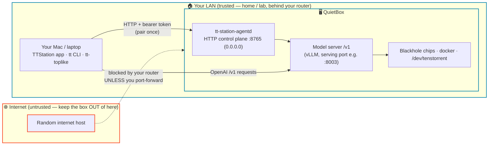

# tt-station — Security FAQ

*Straight answers about what tt-station exposes, how access works, and how to lock it
down — written for a **solo developer** running a QuietBox on their own network, not for
an enterprise security team.*

## TL;DR

tt-station is built for the **trusted network you already control** — your home or lab
LAN, behind your router/firewall. On that network it's designed to be friendly and
low-friction: discover the box, pair once, run models. It is **not** hardened for the
open internet or a hostile multi-tenant network, and it doesn't try to be. If you keep
the box on a network you trust and don't port-forward it to the internet, the defaults
are reasonable. If you want more, there's a [hardening checklist](#hardening-checklist)
at the end.

Nothing here is scary — but everything here is honest. You should know exactly what's on
the wire.

---

## The shape of it



**The trust boundary is your LAN.** The agent binds `0.0.0.0:<ctrl-port>` (default `8765`),
so anything on your LAN can reach it. That's deliberate — it's how your Mac discovers and
talks to the box. The security assumption is that your LAN is *yours*.

---

## How access works

There are two layers of "getting in": **pairing** (to control the agent) and, optionally,
**SSH key provisioning** (to get a shell). Both start from you, at the box.

```mermaid
sequenceDiagram
    participant You as You (at the box)
    participant Mac as Mac (app / tt CLI)
    participant Box as tt-station-agentd

    Note over Mac,Box: 1. Pairing — exchange a short-lived code for a bearer token
    Mac->>Box: POST /pair/init
    Box-->>Mac: pair_id
    Box-->>You: shows a 6-digit code on its screen<br/>(GTK panel / tt console), valid 120s
    You->>Mac: read the code, type it in
    Mac->>Box: POST /pair/complete { pair_id, code }
    Box-->>Mac: 256-bit bearer token (stored in your Keychain)

    Note over Mac,Box: 2. From now on, control calls carry the token
    Mac->>Box: POST /run · /stop · /reset · GET /endpoint<br/>Authorization: Bearer <token>
    Box-->>Mac: ✅ (401 without a valid token)

    Note over Mac,Box: 3. OPTIONAL — grant SSH (only if you ask for it)
    Mac->>Box: tt pair --enable-ssh → POST /ssh/authorize (your public key)
    Box-->>Box: append your key to ttuser's ~/.ssh/authorized_keys<br/>(tagged ttstation:<label>)
```

**The pairing code is a "read it off the box" secret.** It only appears on the box's own
screen (the GTK panel or `tt console`), lives 120 seconds, and a given attempt allows only
5 wrong guesses before it's discarded. So to pair, you generally need to be *looking at the
box*. The result is a **256-bit random bearer token** — that's the real credential; the
code is just how you bootstrap it.

---

## What can someone on my network do?

Endpoints split cleanly into **unauthenticated reads** (informational, work without pairing)
and **authenticated actions** (need a valid bearer token):

| Endpoint | Auth? | What it exposes / does |
|---|---|---|
| `GET /status` | none | box name, chips, device mesh, serving state |
| `GET /models` | none | which models this box can serve |
| `GET /serving` | none | live `/v1` endpoints on the box (incl. external ones) |
| `GET /config` | none | resolved serving config (profile, image, host/port — **no secrets**) |
| `GET /telemetry` (WebSocket) | none | live `tt-smi` chip telemetry **+ a process list** (pid, name, **command line**, cpu/mem) |
| `POST /pair/init` · `/pair/complete` | none | start/finish pairing (needs the on-screen code) |
| `POST /run` · `/stop` · `/reset` | **bearer** | start/stop a model; reset the box |
| `GET /endpoint` | **bearer** | the serving `/v1` URL |
| `POST` / `DELETE /ssh/authorize` | **bearer** | add / remove an SSH public key |

**Without pairing**, a LAN peer can *read* a fair amount (what the box is, what it's
serving, live telemetry) but **cannot run, stop, reset, or SSH.** With a valid token, they
can control serving and reset the box. That's the whole security model: reads are open,
writes need the token.

> **One thing worth knowing:** the telemetry stream (unauthenticated) now includes a
> **process list with command lines**. On a trusted LAN that's just convenient monitoring
> — but don't pass secrets as command-line arguments to processes on the box (good practice
> anyway), since those args are visible to anything on your LAN that reads `/telemetry`.

---

## FAQ

**Is the traffic encrypted (TLS/HTTPS)?**
No. The control plane is plain HTTP and the bearer token travels in an `Authorization`
header in the clear. This is fine on a LAN you trust (the same trust you already extend to,
say, a printer or a NAS admin page), and it keeps setup zero-config. It is **not** okay
across an untrusted network — so don't expose the port to the internet. If you need remote
access, put it behind a VPN or Tailscale (see [hardening](#hardening-checklist)).

**Is the model API (`/v1`) itself protected?**
By default, **no** — the agent launches the model server with `--no-auth`, so anyone who
can reach the serving port on your LAN can send it OpenAI-style requests (i.e. use your GPU
time). That's the friendly default for a personal box. Start the agent with `--require-auth`
if you want the served API to require a key.

**What does "pair with SSH" actually grant?**
`tt pair --enable-ssh` (and the `/ssh/authorize` route) appends **your** SSH public key to
the box user's (`ttuser`) `~/.ssh/authorized_keys`, tagged with a `ttstation:<label>`
marker. That's a **full login shell** as that user — the same access as if you'd run
`ssh-copy-id` yourself. It's **opt-in** (nothing installs a key unless you ask), the key is
validated (only well-formed `ssh-ed25519`/`ssh-rsa` keys, label sanitized against injection),
and `.ssh`/`authorized_keys` permissions are enforced (`0700`/`0600`). Revoke any time with
`tt ssh-authorize --revoke` (removes only the `ttstation:`-tagged line) — it won't touch
keys you added by hand.

**Where are the secrets stored?**
- On the **box**: issued bearer tokens live in `~/.config/tt-station/agentd-tokens.json`,
  written `0600` (owner-only). No passwords; the tokens are the credentials.
- On your **Mac**: the `tt` CLI stores its token in the macOS Keychain (file store as
  fallback). The app tracks *which* hosts are paired locally.

**What privileges does the agent run with?**
It runs as **you** — a `systemctl --user` service under your own account (not root). It can
do what you can: talk to docker, `/dev/tenstorrent`, and `tt-smi`. There's no privilege
escalation and no separate service account; the box is assumed to be your single-user
machine.

**How do I revoke access or wipe pairings?**
- **Reset** (GTK panel button, or clear the box's token store): forgets **all** pairings,
  stops the serving model, resets the board — a clean slate. Clients must pair again.
- **Revoke SSH**: `tt ssh-authorize --revoke` removes the tt-station-added key.
- **Stop it entirely**: `systemctl --user stop tt-station-agentd` — the control plane goes
  offline; a running model container keeps serving until you stop it.

**Can I put this on the internet / access it remotely?**
Don't expose the port directly. Use a VPN or Tailscale so the box stays on a "virtual LAN"
you control — you keep the zero-config friendliness and never put a plaintext control plane
on the open internet.

**Does the box "phone home" / send telemetry anywhere?**
No. Everything is on your LAN. `tt-smi` telemetry and the process list are only sent to
clients that connect to *your* box's `/telemetry` WebSocket. There's no external analytics.

---

## Hardening checklist

For the cautious solo dev, or a box on a network you don't fully trust. None of this is
required for a normal home/lab setup:

- [ ] **Keep it off the internet.** Don't port-forward `8765` (or the serving port). Confirm
      your router isn't exposing them.
- [ ] **Remote access via VPN/Tailscale**, never a raw port-forward.
- [ ] **Firewall the ports** to specific trusted hosts if your LAN has devices you don't
      trust (e.g. IoT gadgets, guests): restrict `8765` and the serving port with `ufw`/nftables.
- [ ] **Require auth on the model API**: run the agent with `--require-auth` so `/v1` isn't
      open to the whole LAN.
- [ ] **Mind the telemetry process list**: don't launch box processes with secrets in their
      argv; the (unauthenticated) `/telemetry` stream exposes command lines.
- [ ] **Rotate/reset** if you suspect a token leaked: Reset the box (invalidates every token)
      and re-pair; revoke any SSH keys you didn't intend to keep.
- [ ] **Only `--enable-ssh` when you mean it** — it grants a shell. Audit `ttstation:`-tagged
      lines in `~/.ssh/authorized_keys`.

---

## What we intentionally keep simple (and why that's fine here)

Being upfront about the trade-offs, so there are no surprises:

- **No TLS on the control plane.** Plaintext HTTP on a trusted LAN, for zero-config setup.
  Mitigation: keep it on your LAN / behind a VPN.
- **No user accounts / RBAC.** One bearer token = full control; the box is a single-operator
  machine. There's no notion of "read-only users" beyond the always-open informational reads.
- **The pairing code isn't a brute-force fortress.** It's a short-lived (120s), on-screen
  6-digit code with 5 guesses per attempt — its real protection is that an attacker must
  already be on your LAN *and* the window is tiny. It's a bootstrap for the 256-bit token,
  not the security boundary itself. On a trusted LAN this is a non-issue; on a hostile LAN,
  firewall the port.
- **The served `/v1` is unauthenticated by default.** Friendly for personal use; flip
  `--require-auth` if that matters to you.

These are deliberate choices for the target audience — a developer running their own box on
their own network. tt-station aims to make *that* experience delightful, and to be honest
with you about where the edges are so you can decide what (if anything) to lock down.

---

*Questions this doesn't answer, or something that looks wrong? The source is the truth —
`crates/tt-station-agentd/src/routes.rs` (the routes + auth), `authkeys.rs` (SSH key
handling), and `pairing.rs` (codes + tokens).*
